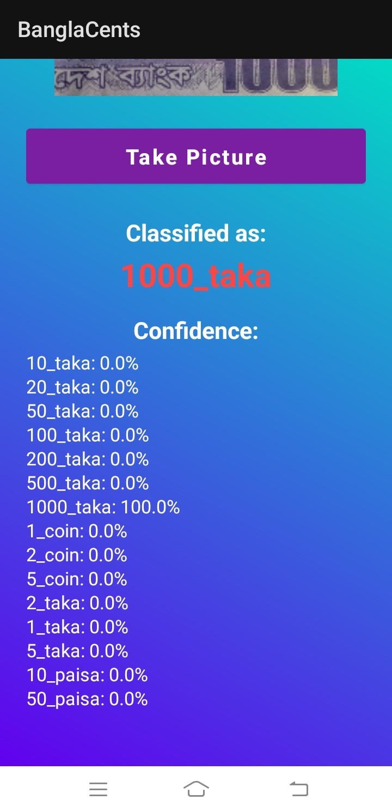
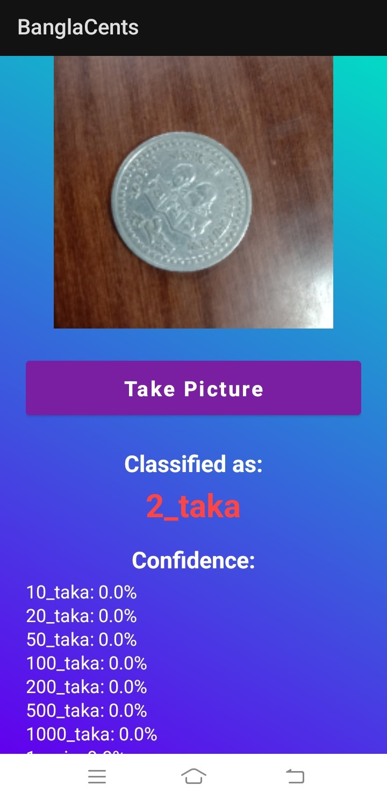
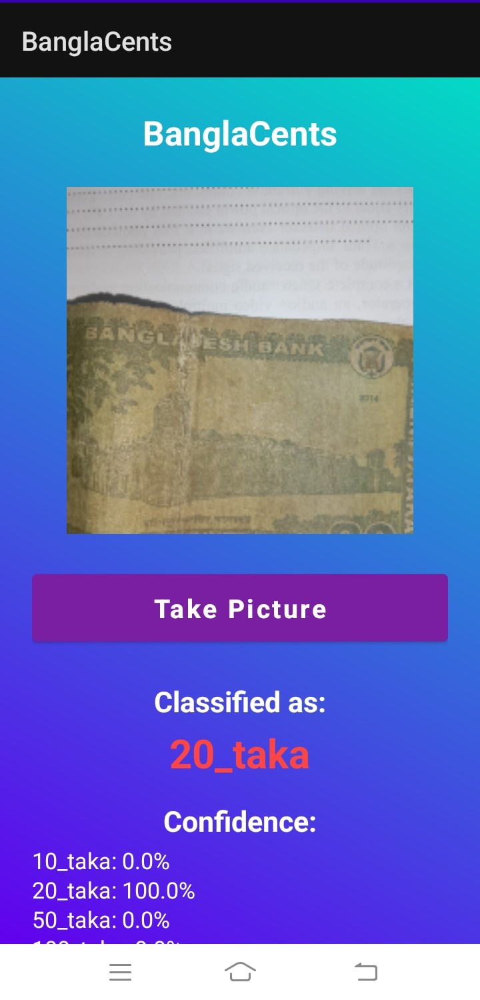
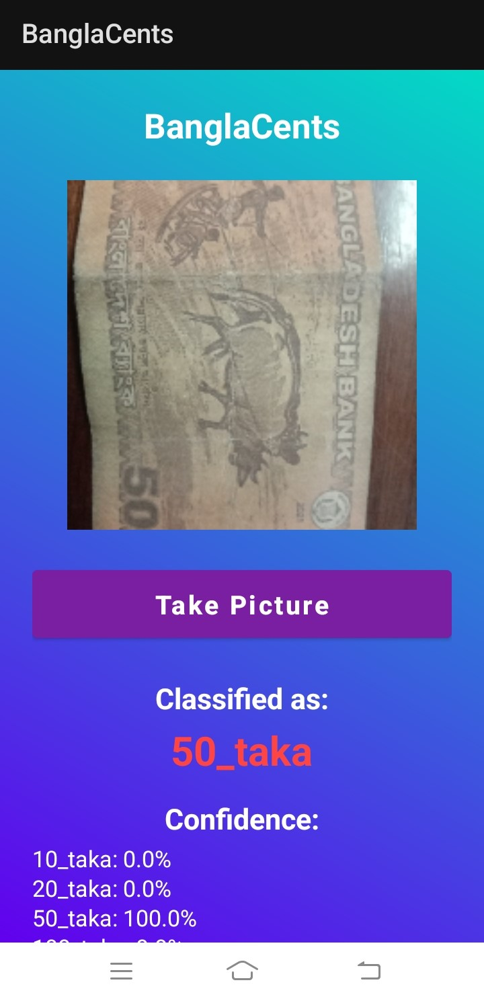
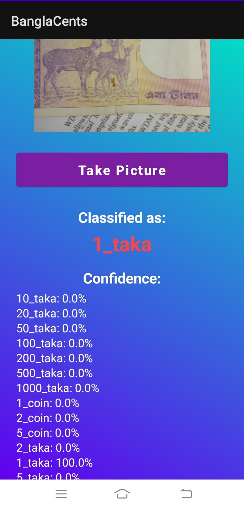

# 🇧🇩 BanglaCents: BD Currency Identifier


**BanglaCents** is an Android application designed to assist users in accurately identifying Bangladeshi currency. Utilizing computer vision and machine learning, the app recognizes both paper notes and metallic coins of various denominations in real-time.

This tool is particularly useful for the visually impaired, tourists, or anyone needing quick verification of currency value.

## 📱 App Screenshots

| 1000 Taka Note | 2 Taka Coin | 20 Taka Note |
|:---:|:---:|:---:|
|  |  |  |

| 50 Taka Note | 500 Taka Note | 1 Taka Note |
|:---:|:---:|:---:|
|  |  |  |

## 🚀 Key Features

* **Real-time Detection:** Instantly classifies currency via the camera feed.
* **Detailed Confidence Scores:** Displays the probability (%) for all recognized classes to ensure accuracy.
* **Comprehensive Support:** Detects both paper notes (from 1 Taka to 1000 Taka) and coins.
* **Offline Capability:** Fully functional without an internet connection.

## 💰 Supported Denominations

The model is trained to identify the following classes:

**Paper Notes:**
* 1 Taka, 2 Taka, 5 Taka
* 10 Taka, 20 Taka, 50 Taka
* 100 Taka, 200 Taka, 500 Taka, 1000 Taka

**Coins:**
* 1 Taka Coin
* 2 Taka Coin
* 5 Taka Coin
* (Experimental support for 10, 25 & 50 Paisa)

## 🛠️ Tech Stack

* **OS:** Android
* **Language:** Kotlin / Java
* **Machine Learning:** TensorFlow Lite / Custom Model
* **UI:** XML / Jetpack Compose

## 📥 Installation

1.  Clone the repository:
    ```bash
    git clone [https://github.com/Prithvi1101/BanglaCents-BD-Currency-Identifier.git](https://github.com/Prithvi1101/BanglaCents-BD-Currency-Identifier.git)
    ```
2.  Open the project in **Android Studio**.
3.  Let Gradle sync and build the project.
4.  Connect an Android device (developer mode enabled) or use an emulator with camera support.
5.  Click **Run**.


## 📄 License

Distributed under the MIT License. See `LICENSE` for more information.
